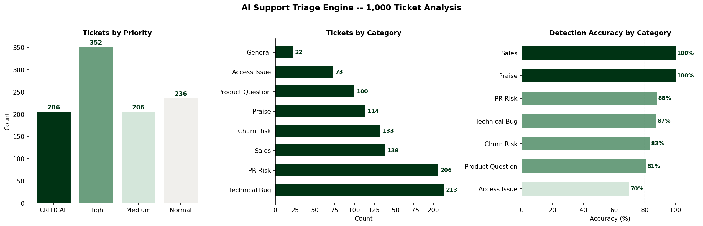

# Support Triage Engine

**Rule-based AI classification pipeline for high-volume enterprise support**

---

## [ 01. THE PROBLEM ]

Enterprise support teams operating at scale face the same structural failure: every ticket enters the same queue regardless of urgency. A billing threat destined for Legal sits next to a password reset. A churn signal from a $50K account waits behind a product question.

Manual triage at volume is slow, inconsistent, and expensive. This engine automates it.

---

## [ 02. WHAT IT DOES ]

A two-stage Python pipeline that ingests raw support ticket text, classifies each ticket by category and sentiment, assigns a strategic priority, and outputs an actionable triage report.

**Input:** 1,000 synthetic enterprise support tickets across 7 categories

**Output:**
- `triaged_tickets_report.csv` -- every ticket with detected category, sentiment score, and priority
- `outputs/triage_analysis.png` -- three-panel visual summary of pipeline performance

**Categories detected:** PR Risk, Technical Bug, Churn Risk, Sales, Access Issue, Product Question, Praise

**Priority levels:** CRITICAL, High, Medium, Normal

---

## [ 03. PIPELINE ARCHITECTURE ]
```
raw_support_tickets.csv
         |
         v
[ Stage 1: Data Generation — generate_tickets.py ]
  40 distinct scenarios across 7 categories
  1,000 tickets with urgency modifiers and customer tiers
  Fixed seed (42) for full reproducibility

         |
         v
[ Stage 2: Classification Engine — triage_engine.py ]
  classify_ticket()
    → Category detection via ordered keyword signals
    → Sentiment scoring (1 = Critical threat, 5 = Praise)
    → Priority assignment using category + sentiment matrix

         |
         v
[ Stage 3: Output ]
  triaged_tickets_report.csv  — full triaged dataset
  outputs/triage_analysis.png — performance visualisation
```

**Classification order matters.** Praise and Sales are detected first to prevent urgency modifiers ("ASAP", "This is blocking our team") from causing false positives in higher-priority categories. PR Risk is evaluated before Technical Bug to ensure legal and reputational threats are never downgraded.

---

## [ 04. PERFORMANCE — 1,000 TICKET SAMPLE ]



**Overall accuracy: 87.2%** across 1,000 tickets

| Category | Accuracy | Priority Assigned |
|---|---|---|
| PR Risk | 88% | CRITICAL |
| Technical Bug | 87% | High / Medium |
| Churn Risk | 83% | High |
| Product Question | 81% | Normal |
| Access Issue | 70% | Medium |
| Praise | 100% | Normal |
| Sales | 100% | High |

**206 Critical PR Risks isolated** for immediate escalation.
**352 High-priority items flagged** for same-day response.

---

## [ 05. SAMPLE CLASSIFICATIONS ]

| Incoming Signal | Detected Category | Priority | Action |
|---|---|---|---|
| "Refunding this or I'm taking this to social media." | PR Risk | CRITICAL | Escalate to Legal/PR |
| "I found a security vulnerability in your portal." | Technical Bug | High | Route to Engineering P1 |
| "We are evaluating other vendors. Hard to justify pricing." | Churn Risk | High | CS Executive Outreach |
| "We are ready to move to Enterprise. Send a quote." | Sales | High | Route to Account Executive |
| "Just wanted to say the support team is phenomenal." | Praise | Normal | Log to Feedback Channel |

---

## [ 06. HOW TO RUN ]
```bash
pip install pandas matplotlib

python generate_tickets.py   # generates raw_support_tickets.csv
python triage_engine.py      # runs classification, outputs report + chart
```

No local setup required -- runs directly in [Google Colab](https://colab.research.google.com) or GitHub Codespaces.

---

## [ 07. DESIGN DECISIONS ]

**Why rule-based instead of a live LLM call?**
The classification logic is deterministic, auditable, and requires no API dependency. This makes the pipeline reproducible and suitable for CI/CD environments. In production, the keyword layer would be replaced or augmented by a fine-tuned classifier or a Claude API call with a structured extraction prompt.

**Why does classification order matter?**
Keyword-based systems are vulnerable to false positives when urgency modifiers overlap with escalation signals. By evaluating Praise and Sales first, we prevent benign tickets from being misclassified as Critical. The ordered chain mirrors how a trained human analyst would triage -- context before keywords.

**Why include sentiment scoring?**
Sentiment score directly drives priority within the Technical Bug category. A frustrated user reporting a crash ("Infuriating", "again") receives a High priority escalation. The same crash reported neutrally ("The export function fails silently") routes to Medium. Same category, different urgency, different treatment.

---

## [ 08. WHAT I WOULD BUILD NEXT ]

- **LLM integration:** Replace keyword detection with a Claude API call for free-text classification. The pipeline architecture is already structured for this -- it is a single function swap.
- **Tier-weighted priority:** Enterprise accounts with Churn Risk signals should escalate faster than SMB. The `customer_tier` column is already in the dataset -- the logic just needs to reference it.
- **Real-time webhook trigger:** Connect to Intercom or Zendesk via webhook so tickets are classified at the moment of creation, not in batch.
- **Feedback loop:** Log misclassified tickets for periodic review and use them to expand the keyword bank -- a lightweight continuous improvement cycle.

---

**Status:** Functional / Documented
**Stack:** Python, Pandas, Matplotlib
**Author:** Mohamed Bah | [LinkedIn](https://www.linkedin.com/in/bah-007700/) | [GitHub](https://github.com/Moezusb)
